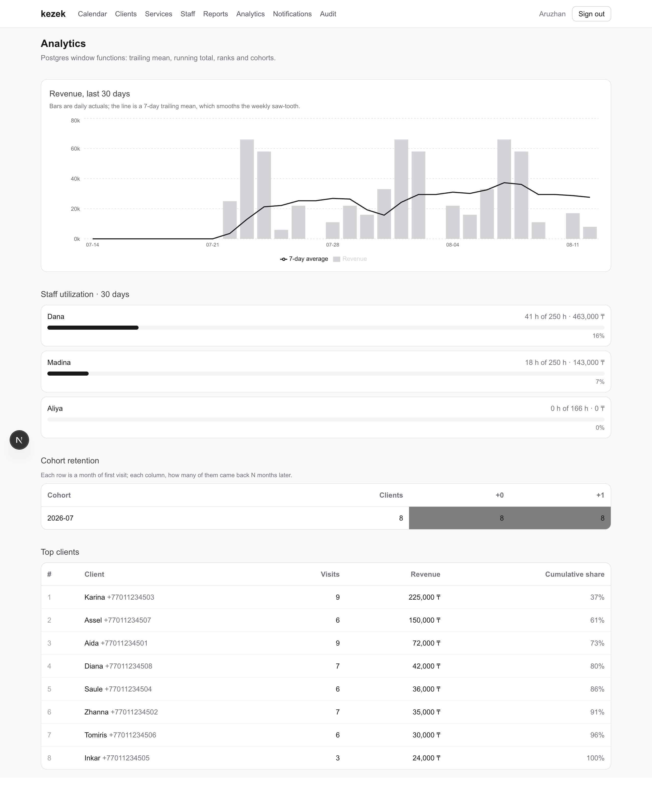
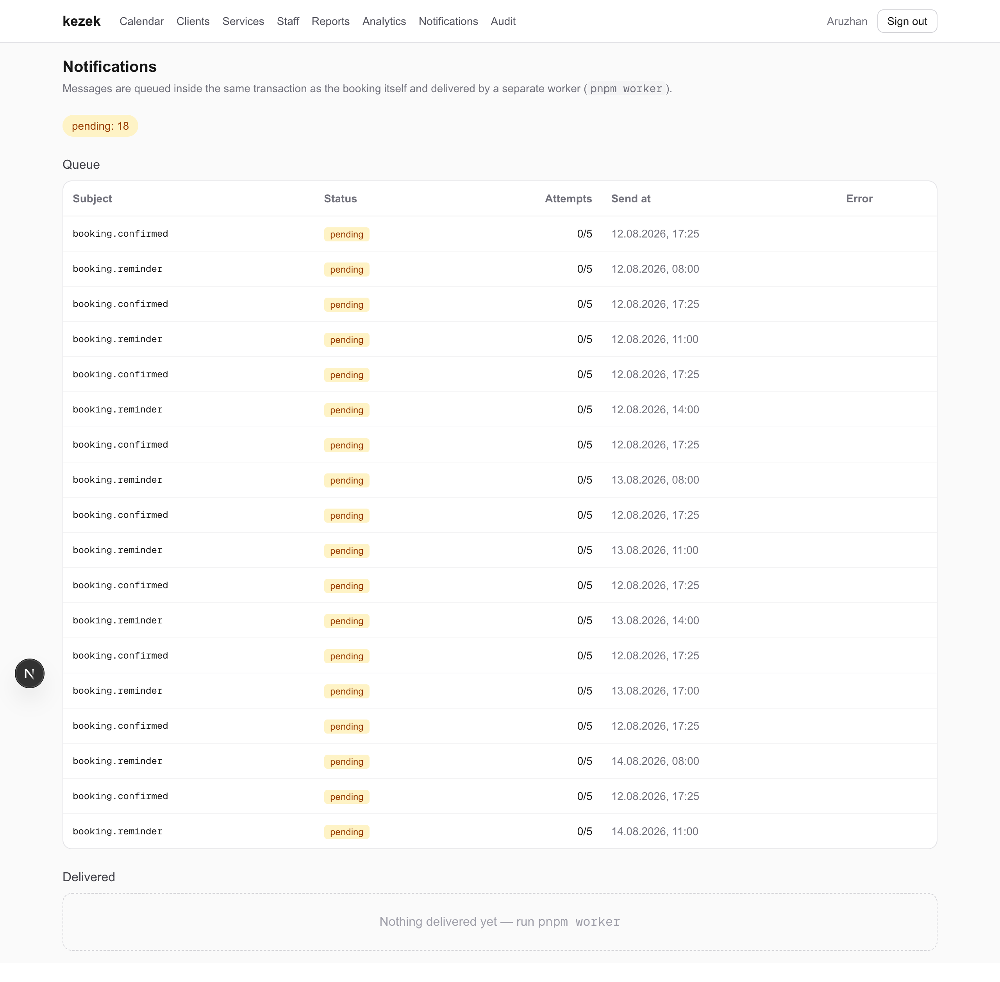

# kezek

[](https://github.com/midat-fx/kezek/actions/workflows/ci.yml)

Online booking platform for service businesses (salons, barbershops, clinics) — **Next.js 16 · PostgreSQL · Redis · Tailwind CSS**.

Clients book a service in a 4-step wizard; the business runs its day from an admin panel with a live calendar, CRM, a waitlist that fills its own cancellations, and analytics. Kazakh «кезек» = "queue".

| Public booking | Slot held while you check out |
|---|---|
|  |  |

**Admin calendar** — per-master day view, updates live over SSE as bookings arrive:


**Reports** — 30-day revenue, per-service breakdown, no-show rate:


**Analytics** — window-function reporting: revenue with a 7-day trailing mean, per-master utilization, cohort retention, Pareto share by client:



**Outbox** — every message is queued inside the business transaction and drained by a worker:



## Why it's interesting under the hood

**Double-booking is prevented twice.** When a client picks a slot, the app places a short-lived **Redis hold** (`SET NX EX`, cart-style reservation with a visible countdown) — the first line of defense. The final insert is guarded by a PostgreSQL **exclusion constraint**:

```sql
ALTER TABLE bookings ADD CONSTRAINT bookings_no_overlap
  EXCLUDE USING gist (staff_id WITH =, tstzrange(start_at, end_at) WITH &&)
  WHERE (status = 'confirmed');
```

Even a race that slips past Redis cannot corrupt the calendar — the database rejects overlap at the transaction level (surfaced to the API as `409 slot_taken`).

**The admin calendar updates live.** Every booking publishes to Redis **pub/sub**; an **SSE** route streams events to the browser, which re-renders the server components. A booking made on a phone appears on the receptionist's screen without a reload.

**The slot engine is pure and unit-tested.** Slot generation (working hours → staff overrides → busy ranges → holds → grid) is plain TypeScript with no I/O, 12 Vitest cases including DST transitions. Timezone math uses the `Intl` API — no date libraries.

**The concurrency claims are tested, not asserted.** The integration suite runs against a real Postgres and Redis and includes the case the design exists for: 100 clients racing for one slot, exactly one of whom may end up with a booking — plus a test that bypasses Redis entirely to prove the exclusion constraint holds on its own, and one that fires ten workers at the outbox to show each message is claimed exactly once.

**Redis does real work**: slot holds, session store (opaque tokens, httpOnly cookie, sliding TTL), per-IP rate limiting on every public endpoint, and pub/sub fan-out.

**Messages cannot disagree with the database.** A booking, its audit entry and its outbound notifications are written in one transaction to a [transactional outbox](src/lib/outbox.ts); a separate worker drains it. Claiming uses `FOR UPDATE SKIP LOCKED` *plus* a lease:

```sql
WITH due AS (
  SELECT id FROM outbox
  WHERE status IN ('pending', 'processing') AND available_at <= now()
  ORDER BY available_at
  FOR UPDATE SKIP LOCKED
  LIMIT $1
)
UPDATE outbox o
SET attempts = o.attempts + 1, status = 'processing',
    available_at = now() + interval '60 seconds'
FROM due WHERE o.id = due.id
RETURNING o.*
```

Row locks end with the statement, so `SKIP LOCKED` alone would let a second worker re-claim a message milliseconds later. The lease keeps it reserved — and doubles as crash recovery, since a worker that dies mid-delivery only holds the message until the lease lapses. Failures back off exponentially and land in a dead state after `max_attempts`.

**A cancellation refills itself.** Cancelling announces the freed slot through the outbox; the longest-waiting eligible client gets a 15-minute exclusive offer, backed by a Redis hold so no walk-in can take it. The deadline is *itself* an outbox message: when it fires the offer lapses and the slot moves down the queue, returning to public stock once nobody is left. The whole chain inherits the queue's retries and scheduling instead of needing a cron.

**Reporting is SQL, not loops.** [analytics.ts](src/lib/analytics.ts) leans on window functions — a dense calendar joined to daily revenue for a gap-free 7-day trailing mean and running total, per-master utilization measured against the hours actually on offer, cohort retention by month of first visit, and `rank()` with a cumulative revenue share.

## Stack

| Layer | Choice |
|---|---|
| Framework | Next.js 16 (App Router, RSC, server actions, route handlers) |
| Database | PostgreSQL 16 + Drizzle ORM (13 tables, generated + hand-written migrations) |
| Cache / realtime | Redis 7 (ioredis): holds, sessions, rate limits, pub/sub → SSE |
| UI | Tailwind CSS 4, Recharts |
| Auth | bcrypt + Redis-backed sessions, middleware-gated `/admin` |
| Background work | Transactional outbox + worker (`pnpm worker`), leased claiming, exponential backoff |
| Tests | Vitest — unit (pure slot engine) and integration against live Postgres + Redis. CI runs both. |

## Run it

```bash
docker compose up -d        # postgres :5433, redis :6379
cp .env.example .env
pnpm install
pnpm db:migrate && pnpm db:seed
pnpm dev
```

- Public booking: http://localhost:3000/aruzhan
- Admin: http://localhost:3000/admin — `owner@kezek.dev` / `kezek-demo`

The seed generates three weeks of settled history plus the next few days, so the
calendar and reports have something in them the moment you log in.
`pnpm screenshots` regenerates the images above against a running dev server.

## Deploy

Runs on free tiers end to end — Vercel + Neon (Postgres) + Upstash (Redis). Step-by-step in [DEPLOY.md](DEPLOY.md), or:

[](https://vercel.com/new/clone?repository-url=https%3A%2F%2Fgithub.com%2Fmidat-fx%2Fkezek&env=DATABASE_URL,REDIS_URL,SESSION_SECRET&envDescription=Postgres%20URL%20(Neon)%2C%20Redis%20URL%20(Upstash)%2C%20and%20a%20random%20session%20secret&envLink=https%3A%2F%2Fgithub.com%2Fmidat-fx%2Fkezek%2Fblob%2Fmain%2FDEPLOY.md)

## Features

- **Public wizard** `/[slug]` — service → master → date/slot → contacts; slot held for 5 min with countdown; graceful recovery when a slot is stolen mid-checkout
- **Admin calendar** — per-master day view, live SSE refresh, one-click status changes (completed / no-show / cancelled)
- **CRM** — clients with visit counts, no-show history, lifetime spend (SQL aggregates)
- **Catalog** — services CRUD, masters, per-master service assignment (M:N), soft hide
- **Reports** — 30-day revenue chart, per-service breakdown, no-show rate
- **Audit log** — every mutation recorded with actor and metadata
- **Waitlist** — a full day offers the queue instead of a dead end; cancellations are offered down it automatically, each offer exclusive for 15 minutes
- **Notifications** — confirmations and next-day reminders through the outbox; the admin sees the queue, its retries and what was delivered
- **Analytics** — trailing-mean revenue, master utilization, cohort retention, client Pareto
- **Public API** — versionless JSON endpoints (`catalog`, `slots`, `hold`, `book`, `waitlist`), all rate-limited, Zod-validated

## Schema

`users`, `businesses`, `business_hours`, `staff`, `staff_hours` (per-master overrides), `services`, `staff_services` (M:N), `clients` (unique per business+phone), `bookings` (exclusion-constrained), `waitlist_entries`, `outbox`, `message_log`, `audit_log` — multi-tenant by design: every row hangs off a `business_id`.

## Tests

```bash
pnpm test              # unit — pure slot engine, no services needed
pnpm test:integration  # against live Postgres + Redis (docker compose up -d)
```

The integration suite builds its own database from the migrations, runs each file serially against it, and uses a separate Redis index so it never touches your dev data.
