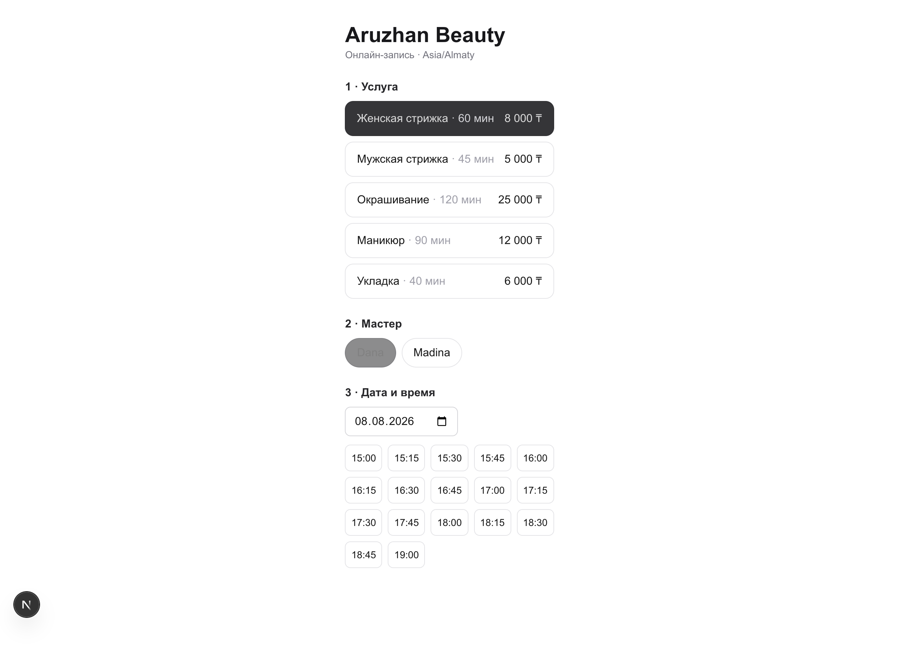
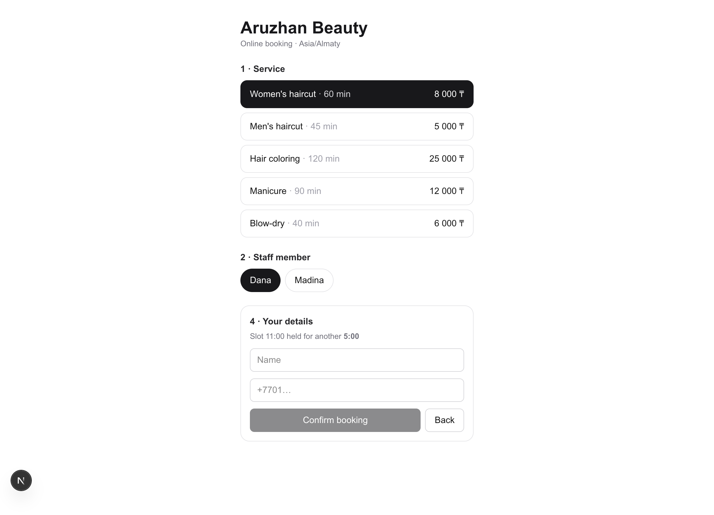
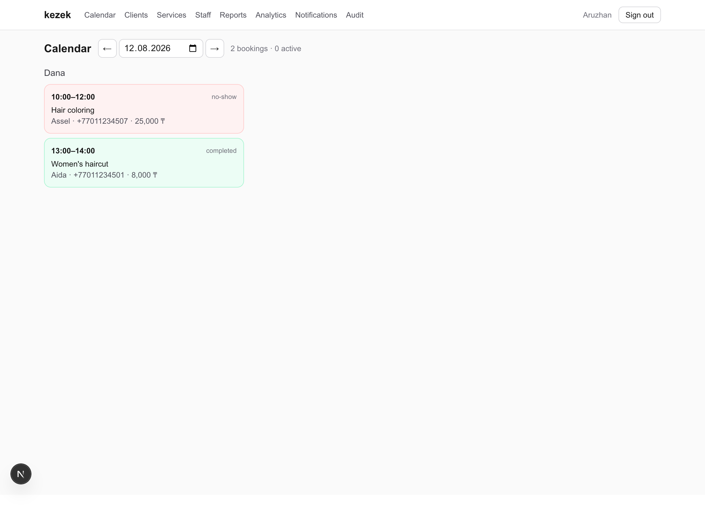
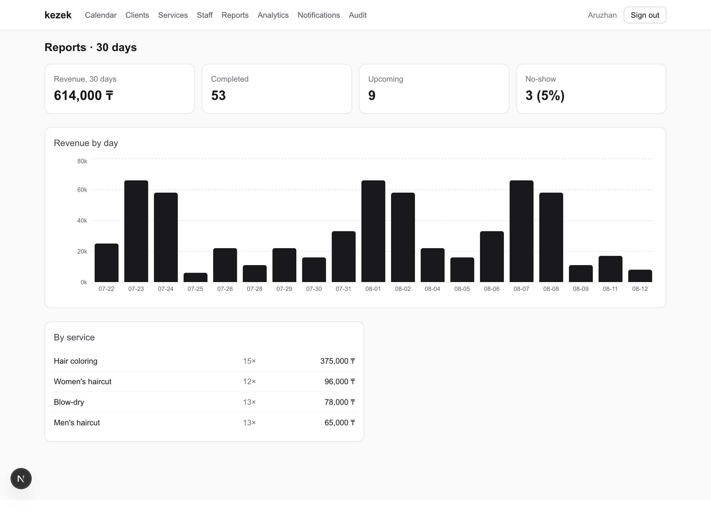

# kezek

Online booking platform for service businesses (salons, barbershops, clinics) — **Next.js 16 · PostgreSQL · Redis · Tailwind CSS**.

Clients book a service in a 4-step wizard; the business runs its day from an admin panel with a live calendar, CRM, and revenue reports. Kazakh «кезек» = "queue".

| Public booking | Slot held while you check out |
|---|---|
|  |  |

**Admin calendar** — per-master day view, updates live over SSE as bookings arrive:



**Reports** — 30-day revenue, per-service breakdown, no-show rate:



## Why it's interesting under the hood

**Double-booking is prevented twice.** When a client picks a slot, the app places a short-lived **Redis hold** (`SET NX EX`, cart-style reservation with a visible countdown) — the first line of defense. The final insert is guarded by a PostgreSQL **exclusion constraint**:

```sql
ALTER TABLE bookings ADD CONSTRAINT bookings_no_overlap
  EXCLUDE USING gist (staff_id WITH =, tstzrange(start_at, end_at) WITH &&)
  WHERE (status = 'confirmed');
```

Even a race that slips past Redis cannot corrupt the calendar — the database rejects overlap at the transaction level (surfaced to the API as `409 slot_taken`).

**The admin calendar updates live.** Every booking publishes to Redis **pub/sub**; an **SSE** route streams events to the browser, which re-renders the server components. A booking made on a phone appears on the receptionist's screen without a reload.

**The slot engine is pure and unit-tested.** Slot generation (working hours → staff overrides → busy ranges → holds → grid) is plain TypeScript with no I/O, 12 Vitest cases including DST transitions. Timezone math uses the `Intl` API — no date libraries.

**Redis does real work**: slot holds, session store (opaque tokens, httpOnly cookie, sliding TTL), per-IP rate limiting on every public endpoint, and pub/sub fan-out.

## Stack

| Layer | Choice |
|---|---|
| Framework | Next.js 16 (App Router, RSC, server actions, route handlers) |
| Database | PostgreSQL 16 + Drizzle ORM (10 tables, generated + hand-written migrations) |
| Cache / realtime | Redis 7 (ioredis): holds, sessions, rate limits, pub/sub → SSE |
| UI | Tailwind CSS 4, Recharts |
| Auth | bcrypt + Redis-backed sessions, middleware-gated `/admin` |
| Tests | Vitest (pure slot engine), CI: lint + test + migrate + seed + build |

## Run it

```bash
docker compose up -d        # postgres :5433, redis :6379
cp .env.example .env
pnpm install
pnpm db:migrate && pnpm db:seed
pnpm dev
```

- Public booking: http://localhost:3000/aruzhan
- Admin: http://localhost:3000/admin — `owner@kezek.dev` / `kezek-demo`

The seed generates three weeks of settled history plus the next few days, so the
calendar and reports have something in them the moment you log in.
`pnpm screenshots` regenerates the images above against a running dev server.

## Deploy

Runs on free tiers end to end — Vercel + Neon (Postgres) + Upstash (Redis). Step-by-step in [DEPLOY.md](DEPLOY.md), or:

[](https://vercel.com/new/clone?repository-url=https%3A%2F%2Fgithub.com%2Fmidat-fx%2Fkezek&env=DATABASE_URL,REDIS_URL,SESSION_SECRET&envDescription=Postgres%20URL%20(Neon)%2C%20Redis%20URL%20(Upstash)%2C%20and%20a%20random%20session%20secret&envLink=https%3A%2F%2Fgithub.com%2Fmidat-fx%2Fkezek%2Fblob%2Fmain%2FDEPLOY.md)

## Features

- **Public wizard** `/[slug]` — service → master → date/slot → contacts; slot held for 5 min with countdown; graceful recovery when a slot is stolen mid-checkout
- **Admin calendar** — per-master day view, live SSE refresh, one-click status changes (completed / no-show / cancelled)
- **CRM** — clients with visit counts, no-show history, lifetime spend (SQL aggregates)
- **Catalog** — services CRUD, masters, per-master service assignment (M:N), soft hide
- **Reports** — 30-day revenue chart, per-service breakdown, no-show rate
- **Audit log** — every mutation recorded with actor and metadata
- **Public API** — versionless JSON endpoints (`catalog`, `slots`, `hold`, `book`), all rate-limited, Zod-validated

## Schema

`users`, `businesses`, `business_hours`, `staff`, `staff_hours` (per-master overrides), `services`, `staff_services` (M:N), `clients` (unique per business+phone), `bookings` (exclusion-constrained), `audit_log` — multi-tenant by design: every row hangs off a `business_id`.
